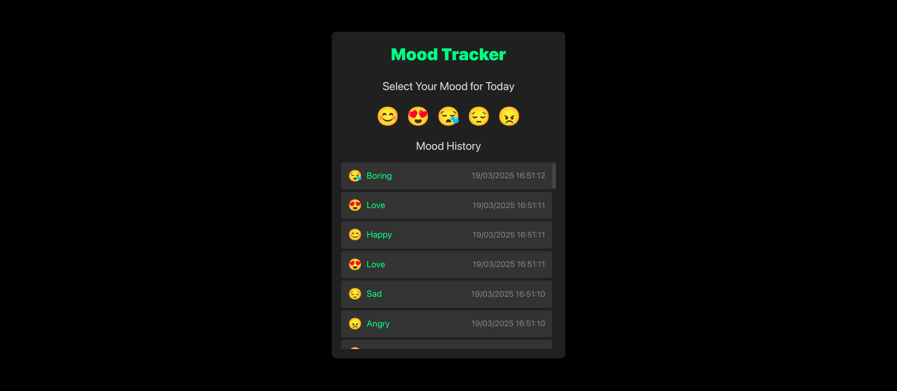

# Mood Tracker

A minimalist web application to track your daily moods with emoji-based logging and history visualization.

## Features

- **Simple Mood Selection**: Choose from 5 different mood emojis (Happy, Love, Boring, Sad, Angry)
- **Persistent Storage**: All mood entries are saved to localStorage in your browser
- **Mood History**: View your complete mood history with timestamps
- **Responsive Design**: Clean, dark-themed interface that works on various screen sizes

## Screenshots

### Frontend

- Pure HTML, CSS, and JavaScript
- No external dependencies or frameworks
- Dark-themed UI with custom styling

### Data Storage

- Uses browser's localStorage API
- Stores mood data as JSON
- Each entry includes:
  - Emoji representation
  - Mood label
  - ISO timestamp

## How to Use

1. Open the HTML file in any modern web browser
2. Click on an emoji that represents your current mood
3. Your selection will be saved and displayed in the history section
4. Return anytime to add new entries or review your mood history

## Project Structure

- **HTML**: Defines the structure of the application
- **CSS**: Provides styling (embedded in the HTML file)
- **JavaScript**: Handles the application logic (embedded in the HTML file)

### State Management

The application uses a simple state object to keep track of:
- Array of mood entries
- Current date

### Core Functions

- `loadMoods()`: Retrieves saved moods from localStorage
- `saveMoods()`: Persists mood data to localStorage
- `addMoodEntry()`: Creates and saves a new mood entry
- `renderMoodHistory()`: Updates the UI to display mood history
- `formatDateTime()`: Formats timestamps for display

## Future Enhancements

Potential improvements that could be added:
- Data visualization with mood patterns over time
- Filtering and sorting options for mood history
- Notes or context for each mood entry
- Export/import functionality for data backup
- Multiple user profiles
